# SWIFT Analytics Dashboard - Moesif Integration Guide

A comprehensive API analytics platform for monitoring and analyzing SWIFT MT/MX message translations in real-time. This guide covers setup, configuration, and deployment of a production-ready Moesif dashboard for SWIFT translation monitoring.

## 🌟 Dashboard Features

- **Real-time Monitoring**: Live message processing statistics and translation status
- **Message Analytics**: Transaction volume analysis with success rates and error tracking
- **Error Analysis**: Categorized error reporting with drill-down capabilities
- **Performance Metrics**: Translation latency, throughput, and processing time analysis
- **Currency Insights**: Transaction breakdown by currency with trend analysis
- **Advanced Search**: Full-text search across all message metadata and content
- **Visual Reports**: Interactive charts, graphs, and comprehensive trend analysis
- **Event Streaming**: Real-time event ingestion and batch processing via HTTP

---

## Table of Contents

1. [Dashboard Features](#-dashboard-features)
2. [About This Guide](#about-this-guide)
3. [Architecture](#architecture)
4. [Quick Start](#quick-start)
5. [Prerequisites](#prerequisites)
6. [Project Structure](#project-structure)
7. [Moesif Setup](#moesif-setup)
8. [Configuration Guide](#configuration-guide)
9. [Dashboard Setup](#dashboard-setup)
10. [Log Mapping](#log-mapping)
11. [Resources](#resources)

---

## About This Guide

This folder contains complete documentation and configuration files for the SWIFT Dashboard monitoring system integrated with Moesif. It includes:

- Moesif account setup instructions
- Pre-configured Fluent Bit configuration
- Lua transformation scripts for log processing
- Dashboard templates and examples
- Complete log mapping documentation

**Quick Access**: Follow the [Quick Start](#quick-start) section to get up and running in minutes.

---

## Architecture

### System Overview

```
┌──────────────────────────┐    ┌─────────────────────┐    ┌───────────────────────────┐
│   SWIFT Sources          │───▶│    Fluent Bit       │───▶│   Moesif Analytics        │
│   (Dashboard/Ballerina)  │    │    Processor        │    │   Platform                │
├──────────────────────────┤    ├─────────────────────┤    ├───────────────────────────┤
│ • Dashboard Logs (JSON)  │    │ • Input: Tail Logs  │    │ • Event Ingestion         │
│ • Ballerina Logs (JSON)  │    │ • Filter: Transform │    │ • Real-time Analytics     │
│ • File Monitoring        │    │   (Lua Scripts)     │    │ • Custom Dashboards       │
│                          │    │ • Output: HTTP      │    │ • Reporting Engine        │
│                          │    │   Batch to Moesif   │    │ • API Insights            │
└──────────────────────────┘    └─────────────────────┘    └───────────────────────────┘
```

### End-to-End Sequence Flow

The following diagram illustrates the complete data flow from the Bank Legacy System through to the Moesif Analytics Dashboard:


**Flow Steps:**
1. Bank Legacy System drops MT103.txt to Input folder
2. SWIFT Translator (Ballerina) detects and processes new file
3. MT (Text) message is translated to MX (XML) format
4. Translated pacs.008.xml is saved to Output folder
5. JSON logs are written (dashboard.log & ballerina.log)
6. Fluent Bit tails log files and assigns tags (mtmx, ballerina_logs)
7. Lua transformation applies Base64 encoding and field mapping
8. HTTPS batch export sends data to Moesif API (TLS encrypted)
9. Bank Admin logs into Moesif Portal
10. Bank Admin views SWIFT Dashboard with analytics

### Fluent Bit Processing Detail

The following diagram shows the internal processing within Fluent Bit:

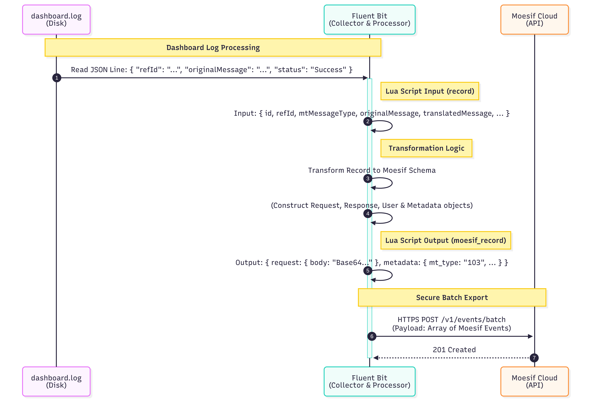

**Processing Steps:**
1. Fluent Bit reads JSON line from dashboard.log
2. Lua script receives input record with fields (id, refId, mtMessageType, originalMessage, etc.)
3. Transformation logic converts record to Moesif schema
4. Request, Response, User & Metadata objects are constructed
5. Output moesif_record with Base64-encoded body and metadata
6. HTTPS POST to /v1/events/batch with array of Moesif events
7. Moesif API returns 201 Created response

---

## Quick Start

### 🚀 5-Minute Setup

1. **Create Moesif Account** → Visit [moesif.com](https://www.moesif.com) and sign up
2. **Create Application** → In Moesif, create a new application named "SWIFT Dashboard"
3. **Copy Collector Application ID** → From Settings → API Keys
4. **Configure Fluent Bit** → Update `fluent-bit.conf` with your Application ID
5. **Start Fluent Bit** → Run the following command:
   ```bash
   # Start Fluent Bit with configuration
   fluent-bit -c /path/to/fluent-bit.conf
   ```
6. **Access Dashboard** → View events in Moesif dashboard

See [Moesif Setup](#moesif-setup) for detailed instructions.

---

## Prerequisites

### System Requirements
- Linux/macOS/Windows 10+ (supported platforms)
- Minimum 4GB RAM (for stable operation)
- Network access

### Account Requirements
- Active Moesif account
- Recommended: Growth Plan for production (1M to 15M Events/mo)

---

## Project Structure

```
moesif-dashboard/
├── README.md                              # This file - complete setup guide
├── config/
│   ├── fluent-bit.conf                   # Main Fluent Bit configuration
│   └── parsers.conf                      # Log parser definitions
├── filter/
│   ├── dashboard-log-transform.lua       # SWIFT message transformation logic
│   └── ballerina-log-transform.lua       # Ballerina log transformation logic
├── dashboards/
│   └── dashboards_template.json          # Pre-built Moesif dashboard template
└── images/
    └── [Documentation images and screenshots]
```

### File Descriptions

- **fluent-bit.conf**: Defines log sources, filters, and output destinations
- **parsers.conf**: Specifies JSON parsing rules for different log formats
- **dashboard-log-transform.lua**: Transforms SWIFT MT/MX logs into Moesif format
- **ballerina-log-transform.lua**: Transforms Ballerina application logs
- **dashboards_template.json**: Pre-configured Moesif dashboard with visualizations

---

## Moesif Setup

### Prerequisites for Moesif

- Valid email address for account creation
- Active internet connection
- Modern web browser (Chrome, Firefox, Safari, Edge)

### Step 1: Create a Moesif Account

1. Visit [moesif.com](https://www.moesif.com)
2. Click **Sign Up** and create a free account
3. Enter your email address and verify your account
4. Set up your organization name and workspace

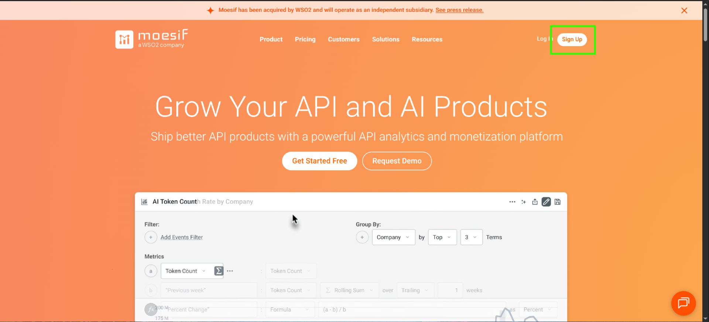

### Step 2: Create an Application

1. Log in to Moesif dashboard
2. Go to **Applications** → **Create Application** or **Add New App**
3. Name it: **SWIFT Dashboard** (or your preferred name)
4. Click **Create** or **Finish**

### Step 3: Get Your Collector Application ID

After application creation:
1. Navigate to **Settings** → **API Keys** 
2. Look for **Collector Application ID**
   - Format: `eyJ...` (long Base64-encoded string)
   - Typically starts with `eyJ` and is 200+ characters long
3. Copy and securely save this ID - you'll need it for Fluent Bit configuration
4. Keep this ID confidential - it authenticates your log collection

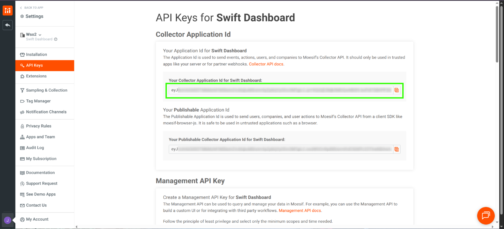

### Step 4: Choose Subscription Plan 

For production deployments, we recommend the **Growth Plan**:
- **Cost**: $132/month (billed annually)
- **Events/Month**: 1M to 15M events
- **Team Members**: Unlimited
- **Data Retention**: 365 days
- **Support**: Priority support included

**Free Plan** is available for testing:
- 30k events/month
- 7-day data retention

---

## Configuration Guide

### Overview

This section guides you through configuring Fluent Bit to collect SWIFT logs and send them to Moesif for analytics. Fluent Bit acts as a log collector and processor, transforming SWIFT dashboard and Ballerina application logs into Moesif-compatible event format.

### Step 1: Download and Install Fluent Bit

**Linux (Ubuntu/Debian):**
```bash
curl https://raw.githubusercontent.com/fluent/fluent-bit/master/install.sh | sh

# Or download from: https://fluentbit.io/download/
# Extract and install according to your platform
```

### Step 2: Create Fluent Bit Configuration (`fluent-bit.conf`)

```ini
[SERVICE]
    flush        1
    daemon       Off
    log_level    info
    parsers_file /config/parsers.conf                   # <path to parsers config>
    plugins_file /etc/fluent-bit/plugins.conf
    http_server  On
    http_listen  0.0.0.0
    http_port    2020
    storage.metrics on

[INPUT]
    Name             tail
    Tag              mtmx
    Path             /logs/dashboard*.log               # <path to dashboard logs>
    Parser           json
    Refresh_Interval 1
    exit_on_eof      off

[INPUT]
    Name             tail
    Tag              ballerina_logs
    Path             /logs/ballerina*.log               # <path to ballerina logs>
    Parser           ballerina_json_parser
    Refresh_Interval 1
    exit_on_eof      off

[FILTER]
    Name    lua
    Match   mtmx
    Script  /filter/dashboard-log-transform.lua        # <path to lua script>
    Call    moesif_transform

[FILTER]
    Name    lua
    Match   ballerina_logs
    Script  /filter/ballerina-log-transform.lua        # <path to lua script>
    Call    ballerina_transform

[OUTPUT]
    Name            http
    Match           mtmx
    Host            api.moesif.net
    Port            443
    URI             /v1/events/batch
    Format          json
    Header          X-Moesif-Application-Id <your moesif application id>
    Header          Content-Type application/json
    tls             On
    tls.verify      On
    json_date_format iso8601

[OUTPUT]
    Name            http
    Match           ballerina_logs
    Host            api.moesif.net
    Port            443
    URI             /v1/events/batch
    Format          json
    Header          X-Moesif-Application-Id <your moesif application id>
    Header          Content-Type application/json
    tls             On
    tls.verify      On
    json_date_format iso8601
```

📁 **Source file:** [`config/fluent-bit.conf`](config/fluent-bit.conf)

### Step 3: Create Parsers Configuration (`parsers.conf`)

```ini
[PARSER]
    Name        ballerina_json_parser
    Format      json
    Time_Key    time
    Time_Format %Y-%m-%dT%H:%M:%S.%L%z
    Time_Keep   On

[PARSER]
    Name        json
    Format      json
    Time_Key    time
    Time_Format %d/%b/%Y:%H:%M:%S %z
```

📁 **Source file:** [`config/parsers.conf`](config/parsers.conf)

### Step 4: Create Dashboard Log Transform (`dashboard-log-transform.lua`)

```lua
-- Remove leading and trailing quotes from a string
local function strip_quotes(s)
    if type(s) == "string" then
        return s:gsub('^"(.*)"$', '%1')
    end
    return s
end

local b='ABCDEFGHIJKLMNOPQRSTUVWXYZabcdefghijklmnopqrstuvwxyz0123456789+/'

function enc(data)
    return ((data:gsub('.', function(x)
        local r,b='',x:byte()
        for i=8,1,-1 do r=r..(b%2^i-b%2^(i-1)>0 and '1' or '0') end
        return r;
    end)..'0000'):gsub('%d%d%d?%d?%d?%d?', function(x)
        if (#x < 6) then return '' end
        local c=0
        for i=1,6 do c=c+(x:sub(i,i)=='1' and 2^(6-i) or 0) end
        return b:sub(c+1,c+1)
    end)..({ '', '==', '=' })[#data%3+1])
end

local function detectXml(message)
    if not message or message == "" then
        return false
    end
    local msg = tostring(message)
    -- Pattern 1: Starts with < and contains >
    if msg:match("^%s*<[%s%S]*>") then
        return true
    end
    -- Pattern 2: Contains XML declaration
    if msg:find("<?xml", 1, true) then
        return true
    end
    -- Pattern 3: Contains SOAP Envelope
    if msg:find("<Envelope", 1, true) then
        return true
    end
    -- Pattern 4: Contains ISO 20022 Document
    if msg:find("<Document", 1, true) then
        return true
    end
    -- Pattern 5: Simple check - starts with <
    if msg:match("^%s*<") then
        return true
    end
    return false
end

local function getContentType(message)
    if detectXml(message) then
        return "application/xml"
    else
        return "text/plain"
    end
end

function moesif_transform(tag, timestamp, record)
    -- 1. Extract Raw Values
    local fileId = record["id"] or ""
    local refId = record["refId"] or ""
    local user_id = "UNKNOWN"
    if refId ~= "" then user_id = refId elseif fileId ~= "" then user_id = fileId end

    local mtType = record["mtMessageType"] or ""
    local mxType = record["mxMessageType"] or ""
    local currency = record["currency"] or ""
    local amount = tonumber(record["amount"]) or 0
    local direction = record["direction"] or ""
    local status = record["status"] or "unknown"
    local log_date = record["date"] or os.date("!%Y-%m-%dT%H:%M:%SZ", timestamp)

    local originalMsg = record["originalMessage"] or ""
    local translatedMsg = record["translatedMessage"] or "N/A"
    -- Remove extra quotes from translatedMsg if present
    translatedMsg = strip_quotes(translatedMsg)

    -- 2. Normalize Status
    local statusNorm = string.lower(status)
    local httpStatus = 400
    if statusNorm == "successful" then
        httpStatus = 200
    elseif statusNorm == "skipped" then
        httpStatus = 202
    end

    -- 3. Detect Message Content and Get Content-Type
    local reqContentType = getContentType(originalMsg)
    local resContentType = getContentType(translatedMsg)
    local reqEncoding = "base64"
    local resEncoding = "base64"

    -- 4. Encode Messages
    local reqBody = enc(originalMsg)
    local resBody = enc(translatedMsg)

    -- 5. Construct Metadata
    local metadata = {
        event_kind = "dashboard_log",
        source_file = fileId,
        date = log_date,
        transaction_id = refId,
        mt_type = mtType,
        mx_type = mxType,
        currency = currency,
        amount = amount,
        direction = direction,
        status_text = statusNorm,
        field_error = record["fieldError"] or "",
        not_supported_error = record["notSupportedError"] or "",
        invalid_error = record["invalidError"] or "",
        other_error = record["otherError"] or ""
    }

    -- 6. Build Final Moesif Record
    local moesif_record = {
        request = {
            time = log_date,
            uri = "/swift-translation",
            verb = "POST",
            headers = {
                ["Content-Type"] = reqContentType
            },
            body = reqBody,
            transfer_encoding = reqEncoding
        },
        response = {
            time = log_date,
            status = httpStatus,
            headers = {
                ["Content-Type"] = resContentType
            },
            body = resBody,
            transfer_encoding = resEncoding
        },
        user_id = user_id,
        metadata = metadata
    }

    -- Return: Code 2 (Replace Record), Timestamp, New Record
    return 2, timestamp, moesif_record
end
```

📁 **Source file:** [`filter/dashboard-log-transform.lua`](filter/dashboard-log-transform.lua)

### Step 5: Create Ballerina Log Transform (`ballerina-log-transform.lua`)

```lua
function ballerina_transform(tag, timestamp, record)
    -- Extract fields from Ballerina log record
    local time = record["time"] or os.date("!%Y-%m-%dT%H:%M:%S.000Z")
    local level = record["level"] or "INFO"
    local module = record["module"] or "unknown"
    local message = record["message"] or ""

    -- Extract listener name from module
    local listenerName = extractListenerName(module)

    -- Build metadata object with Ballerina-specific fields
    local metadata = {
        event_kind = "ballerina_log",
        log_level = level,
        module = module,
        listener_name = listenerName,
        log_message = message,
        timestamp = time
    }

    -- Build Moesif event for Ballerina log
    local moesif_record = {
        timestamp = time,
        request = {
            time = time,
            uri = "/ballerina/logs",
            verb = "LOG",
            headers = {
                ["Content-Type"] = "text/plain"
            },
            body = ""
        },
        response = {
            time = time,
            status = 200,
            headers = {},
            body = {}
        },
        metadata = metadata
    }

    -- Return: code 2 (modify record), timestamp, moesif_record
    return 2, timestamp, moesif_record
end

-- Extract listener name from module string
function extractListenerName(module)
    if module == nil or module == "" then
        return "Unknown"
    end
    
    return module
end
```

📁 **Source file:** [`filter/ballerina-log-transform.lua`](filter/ballerina-log-transform.lua)

### Step 6: Start Fluent Bit

```bash
# Start Fluent Bit with configuration
fluent-bit -c /path/to/fluent-bit.conf
```

---

## Dashboard Setup

### Overview

Moesif provides pre-built dashboards and workspace templates that you can import to visualize your SWIFT translation data.

### Step 1: Access Dashboard Template

The pre-built dashboard template is included in this project:
- **File**: `dashboards/dashboards_template.json`
- **Includes**: Multiple dashboards and workspaces

### Step 2: Import Dashboard to Moesif

1. **Log in to Moesif**
   - Navigate to [https://www.moesif.com](https://www.moesif.com)
   - Sign in with your credentials
   - Go to your created Application (SWIFT Dashboard)

2. **Delete Pre-existing Dashboards (Optional)**
   - There may be pre-existing default dashboards (e.g., Product, Customer Success, Engineering, Security, Sales, Marketing, Profile Dashboards)
   - Delete these to avoid confusion with the SWIFT dashboards

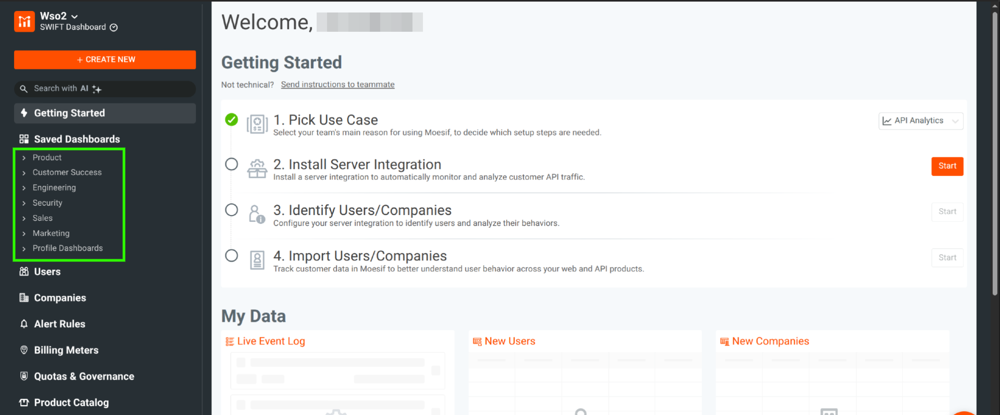


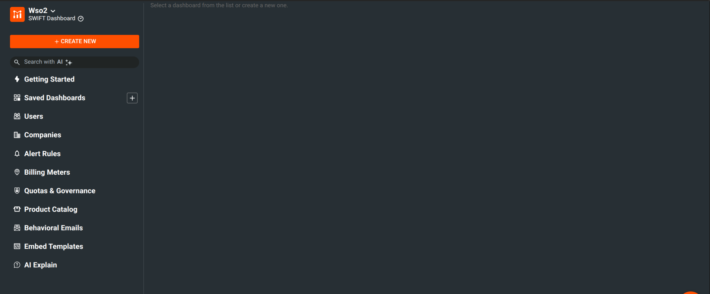

3. **Access Dashboard Creation**
   - Click **+ CREATE NEW** button

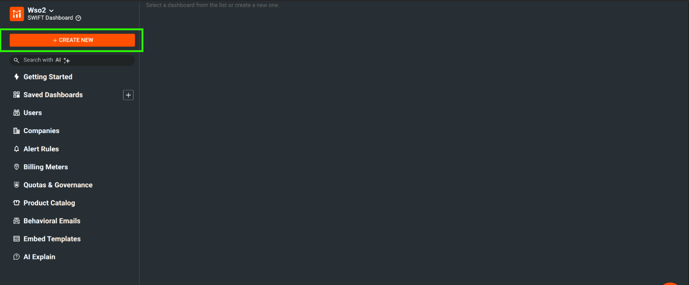

   - Select **Dashboard Templates** under Dashboards/Workspaces

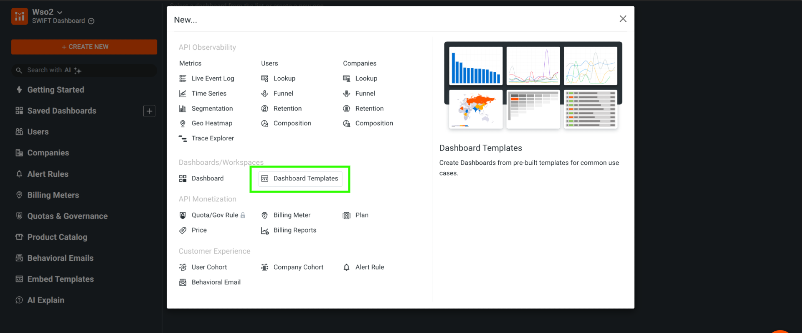

4. **Import JSON Template**
   - Click **Import JSON Template...**
   - Upload: `dashboards/dashboards_template.json`
   - Review the preview of dashboards and workspaces to be imported
   - Click **Import From Template** to start the import


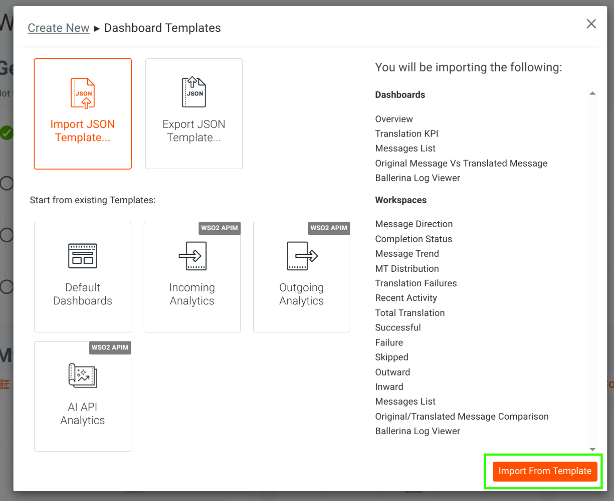

5. **Wait for Import to Complete**
   - Dashboard creation may take 30-60 seconds
   - You'll see green checkmarks next to each imported item
   - Click **Import Completed** when finished

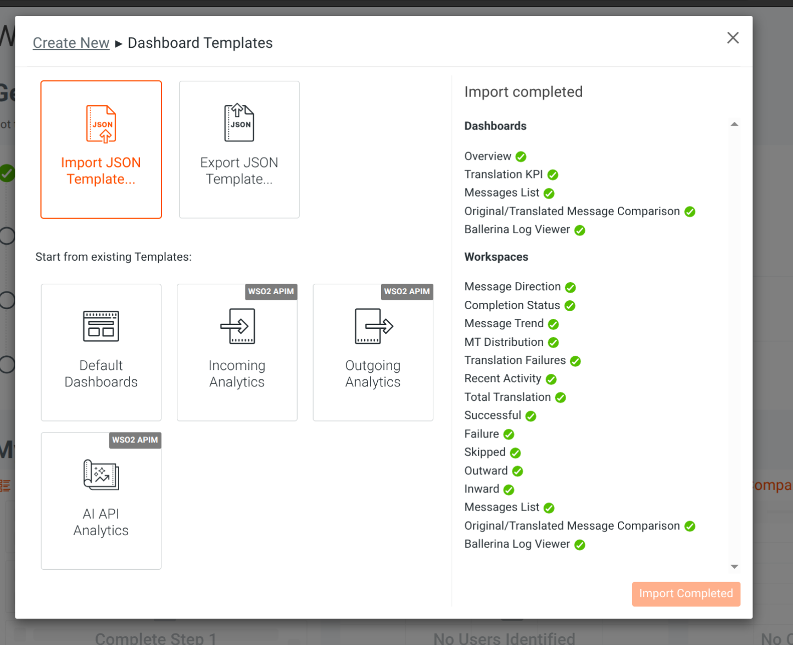

6. **Verify Imported Dashboards**
   - Check the **Saved Dashboards** section in the left sidebar
   - You should see all imported dashboards:
     - Overview
     - Translation KPI
     - Messages List
     - Original/Translated Message Comparison
     - Ballerina Log Viewer


### Step 3: Explore Dashboard Features

Your imported dashboard will include multiple workspaces and visualizations:

**Main Dashboards:**

- **Overview Dashboard**
  - **Message Direction**: Outward vs Inward message breakdown
  - **Completion Status**: Success, Skipped, Failed rate distribution
  - **Message Trend**: Historical message volume over time
  - **MT Distribution**: Message type (MT103, MT104, etc.) breakdown
  - **Translation Failures**: Detailed error analysis with categories
  - **Recent Activity**: Latest 50 transactions

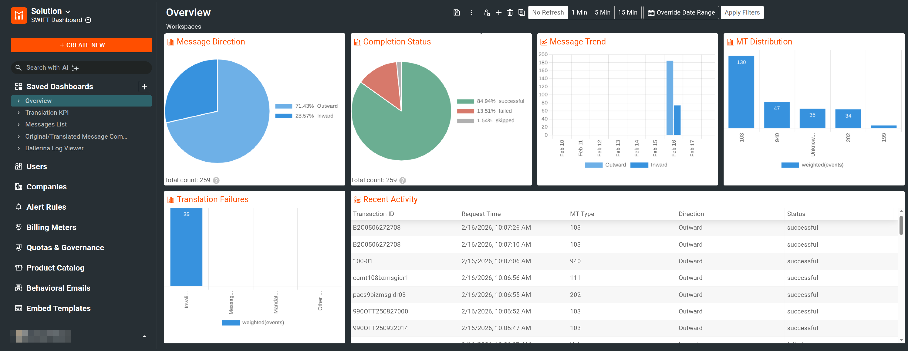

- **Translation KPI Dashboard**
  - **Total Translation**: Overall message count
  - **Successful**: Success message count
  - **Failure**: Failure message count
  - **Skipped**: Skipped message count
  - **Outward**: Outbound message count
  - **Inward**: Inbound message count

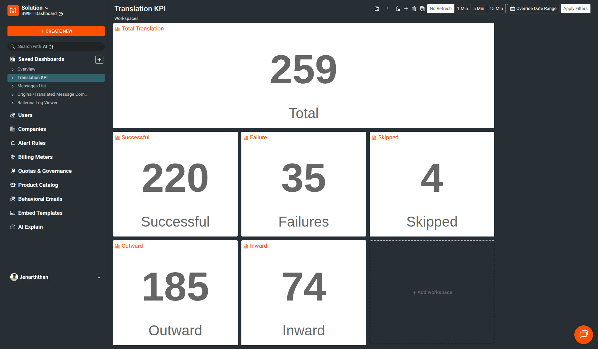

- **Messages List Dashboard**
  - Complete list of all translated messages
  - Full-text search across message content
  - Detailed metadata for each transaction

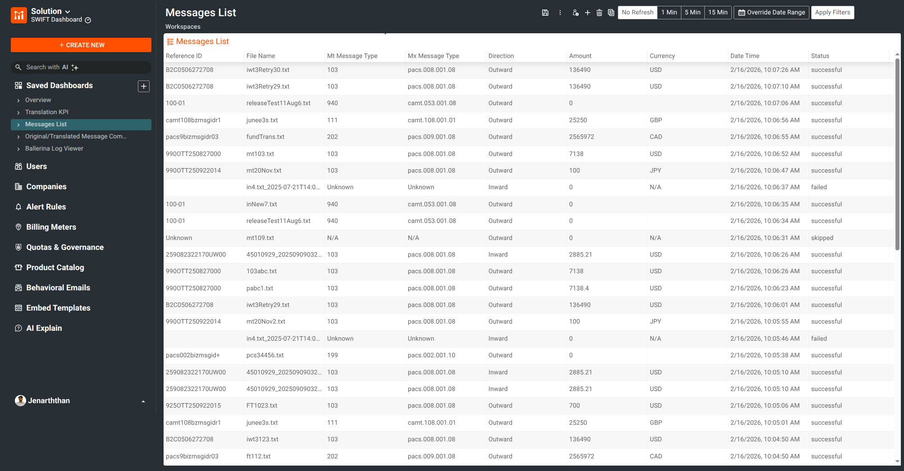

- **Original/Translated Message Comparison Dashboard**
  - Side-by-side comparison of original MT and translated MX messages
  - JSON view for original message, XML view for translated message

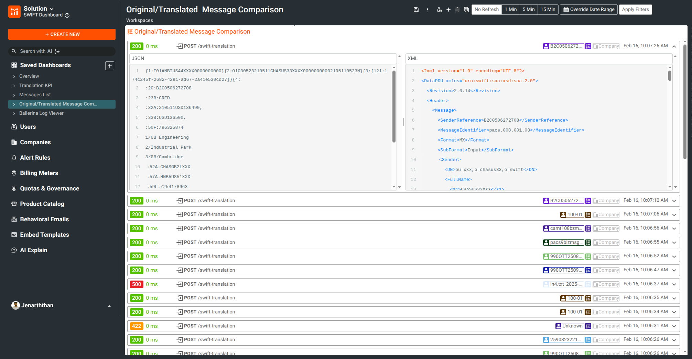

- **Field Comparison View**
  - Detailed field-level comparison between MT and MX formats
  - Configure comparison fields for custom analysis

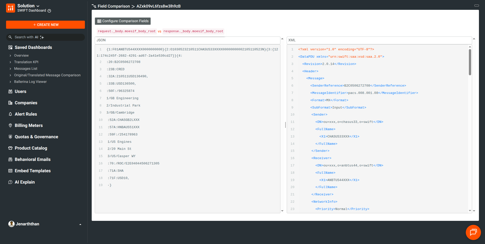

### Step 4: Finding and Viewing Transactions

#### Suppose you want to find out the transaction ID and view that in the Message Comparison view

**Workflow:**

1. **View All Transactions**
   - Navigate to **Original/Translated Message Comparison** dashboard
   - See all transactions listed with their status codes (202, 200, 400, etc.)

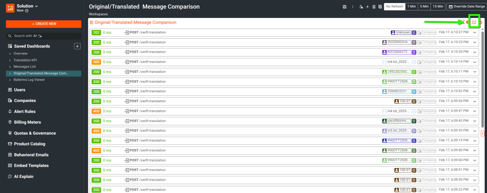

2. **Apply Filters to Find Specific Transaction**
   - Click on the **Filters** section to expand filter options
   - Use **Events Where** to filter by metadata fields:

```
metadata.event_kind = "dashboard_log"
metadata.transaction_id = "ia"  (or your specific transaction ID)
```


3. **View Filter Metadata Options**
   - Expand the **Metadata** dropdown to see all available fields:
     - `amount` - Transaction amount
     - `currency` - Currency code
     - `date` - Transaction date
     - `direction` - Message direction (Outward/Inward)
     - `event_kind` - Event type (dashboard_log/ballerina_log)
     - `field_error`, `invalid_error` - Error details
     - `listener_name` - Ballerina listener
     - `mt_type`, `mx_type` - Message types
     - `transaction_id` - Transaction reference ID

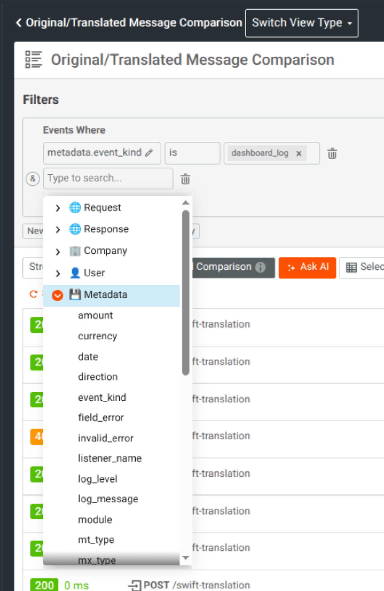

4. **Select Transaction Row**
   - Click on a transaction row to expand its details
   - View the request/response comparison


5. **Field Comparison View**
   - Use **Configure Comparison Fields** button to customize which fields to compare
   - Compare specific MT and MX fields side-by-side

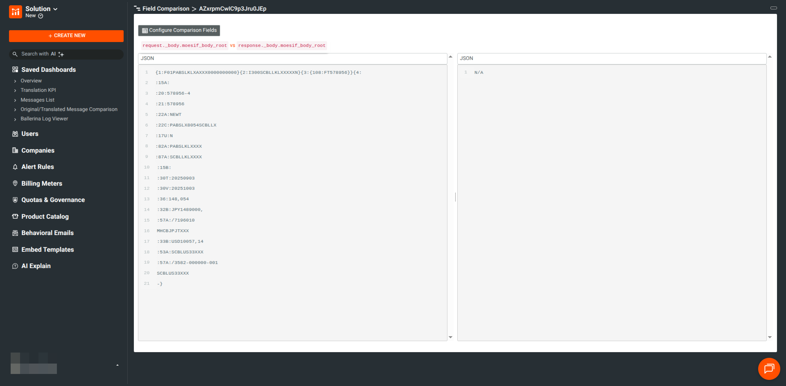

---

- **Ballerina Log Viewer**
  - Application-level logs 
  - Log level distribution (INFO, DEBUG, WARN, ERROR)
  - Module and listener name filtering
  - Real-time log searching


---

## Log Mapping

This section explains how Dashboard logs and Ballerina logs are transformed, mapped, and visualized in Moesif dashboards.

### 1. Dashboard Logs

**Event Kind:** `dashboard_log`

#### JSON Structure Example

```json
{
  "request": {
    "time": "<log_date>",
    "uri": "/swift-translation",
    "verb": "POST",
    "headers": {
      "Content-Type": "<reqContentType>"
    },
    "body": "<base64-encoded originalMessage>",
    "transfer_encoding": "base64"
  },
  "response": {
    "time": "<log_date>",
    "status": 200,
    "headers": {
      "Content-Type": "<resContentType>"
    },
    "body": "<base64-encoded translatedMessage>",
    "transfer_encoding": "base64"
  },
  "user_id": "<user_id>",
  "metadata": {
    "event_kind": "dashboard_log",
    "source_file": "<fileId>",
    "date": "<log_date>",
    "transaction_id": "<refId>",
    "mt_type": "<mtType>",
    "mx_type": "<mxType>",
    "currency": "<currency>",
    "amount": 0,
    "direction": "<direction>",
    "status_text": "<statusNorm>",
    "field_error": "<fieldError>",
    "not_supported_error": "<notSupportedError>",
    "invalid_error": "<invalidError>",
    "other_error": "<otherError>"
  }
}
```

#### Field Mapping

| Original Log Field | JSON Field (request/response/metadata) | Description |
|---|---|---|
| `originalMessage` | `request.body` | Original message, base64 encoded |
| `translatedMessage` | `response.body` | Translated message, base64 encoded |
| `fileId` | `metadata.source_file` | Source file identifier |
| `log_date` | `request.time`, `response.time`, `metadata.date` | Log timestamp (ISO8601) |
| `refId` | `metadata.transaction_id`, `user_id` | Transaction/reference ID, user identifier |
| `mtType` | `metadata.mt_type` | MT message type |
| `mxType` | `metadata.mx_type` | MX message type |
| `currency` | `metadata.currency` | Currency code |
| `amount` | `metadata.amount` | Transaction amount |
| `direction` | `metadata.direction` | Message direction |
| `statusNorm` | `metadata.status_text`, `response.status` | Status (normalized), HTTP status |
| `status` | `response.status` | HTTP status code (200=successful, 202=skipped, 400=failed) |
| `fieldError` | `metadata.field_error` | Field error details |
| `notSupportedError` | `metadata.not_supported_error` | Not supported error details |
| `invalidError` | `metadata.invalid_error` | Invalid error details |
| `otherError` | `metadata.other_error` | Other error details |
| `reqContentType` | `request.headers.Content-Type` | Request content type (application/xml or text/plain) |
| `resContentType` | `response.headers.Content-Type` | Response content type (application/xml or text/plain) |

#### Dashboards Using Dashboard Logs

**Overview Dashboard:**
- **Message Direction** - Pie chart showing message distribution by direction (Inward/Outward)
- **Completion Status** - Pie chart showing status distribution (Successful/Failed/Skipped)
- **Message Trend** - Time series chart showing message volume over 7 days
- **MT Distribution** - Pie chart showing MT message type distribution
- **Translation Failures** - Breakdown of failure types (Invalid Message, Not Supported, Field Error, Other)
- **Recent Activity** - Table view of latest 50 messages

**Translation KPI Dashboard:**
- **Total Translation** - Total count of all translations
- **Successful** - Count of successful translations
- **Failure** - Count of failed translations
- **Skipped** - Count of skipped translations
- **Outward** - Count of outward messages
- **Inward** - Count of inward messages

**Messages List Dashboard:**
- Table view showing all messages with columns: Reference ID, File Name, MT Type, MX Type, Direction, Amount, Currency, Date Time, Status

**Message Comparison Dashboard:**
- Side-by-side comparison view of original vs translated messages (base64-encoded)

---

### 2. Ballerina Logs

**Event Kind:** `ballerina_log`

#### JSON Structure Example

```json
{
  "timestamp": "<time>",
  "request": {
    "time": "<time>",
    "uri": "/ballerina/logs",
    "verb": "LOG",
    "headers": {
      "Content-Type": "text/plain"
    },
    "body": ""
  },
  "response": {
    "time": "<time>",
    "status": 200,
    "headers": {},
    "body": {}
  },
  "metadata": {
    "event_kind": "ballerina_log",
    "log_level": "<level>",
    "module": "<module>",
    "listener_name": "<listenerName>",
    "log_message": "<message>",
    "timestamp": "<time>"
  }
}
```

#### Field Mapping

| Original Log Field | JSON Field (request/response/metadata) | Description |
|---|---|---|
| `time` | `timestamp`, `request.time` | Log timestamp (ISO8601) |
| `level` | `metadata.log_level` | Log level (e.g., INFO, ERROR, WARN) |
| `module` | `metadata.module` | Module name |
| `listenerName` | `metadata.listener_name` | Listener name (parsed from module) |
| `message` | `metadata.log_message` | Original log message |

#### Dashboards Using Ballerina Logs

**Ballerina Log Viewer:**
- Table view showing application logs with columns: Timestamp, Level, Module, Message
- Filtered by `metadata.event_kind = "ballerina_log"`

---

### 3. Filtering in Moesif

To distinguish between log types, filter by `metadata.event_kind`:

- **Dashboard Logs**: `metadata.event_kind = "dashboard_log"`
- **Ballerina Logs**: `metadata.event_kind = "ballerina_log"`

---

### 4. Notes

- Each dashboard references one or more workspaces filtered by `metadata.event_kind`
- Dashboard logs contain base64-encoded messages (request and response bodies)
- Ballerina logs contain plain text messages for easier readability
- HTTP status codes for dashboard logs:
  - **200**: Successful translation (200 OK)
  - **202**: Skipped translation (202 Accepted)
  - **400**: Failed translation (400 Bad Request)
- All timestamps are in ISO8601 format

---

### 5. Current Implementation

Both transformers (`filter/dashboard-log-transform.lua` and `filter/ballerina-log-transform.lua`) implement the mappings above using Lua scripting in Fluent Bit. The transformation occurs in real-time as logs are collected, before they are sent to the Moesif API.

---

## Resources

- **Moesif API Documentation**: [moesif.com/docs](https://www.moesif.com/docs)
- **Fluent Bit Official Docs**: [docs.fluentbit.io](https://docs.fluentbit.io)
- **Fluent Bit Lua Filter Guide**: [docs.fluentbit.io/manual/data-pipeline/filters/lua](https://docs.fluentbit.io/manual/data-pipeline/filters/lua)
- **Lua Script Guide**: [lua.org](https://www.lua.org)

---

**Last Updated**: February 2026  
**Version**: 1.0  
**Project**: SWIFT Dashboard for Moesif Analytics 